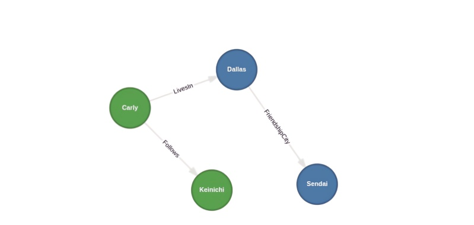

+++
title = "Cypher CREATE and RETURN"
date = "2025-03-26"
draft = false

[taxonomies]
tags=["Cypher", "KuzuDB"]

[extra]
comment = false
+++

## CREATE

Starting with an empty graph database, our first task is to lay down the database schehma. As we go about this, the Cypher ```CREATE``` 
clause comes in handy for provisioning database tables that store *graph nodes* and the *relationships* between them. 

Here's a simple schema made up of two node tables: ```User``` and ```City```. Immedately after we specify them, we create 
the ```Follows``` ```LivesIn``` and ```FriendshipCity``` tables to store the various relationships between users and cities.

```cypher
CREATE NODE TABLE User (name STRING, age INT64, PRIMARY KEY(name));
CREATE NODE TABLE City (name STRING, population INT64, PRIMARY KEY(name));
CREATE REL TABLE Follows (FROM User TO User, since DATE);
CREATE REL TABLE LivesIn (FROM User TO City, since DATE);
CREATE REL TABLE FriendshipCity (FROM City TO City, since DATE);
```
In the next section we'll see how  to use ```CREATE``` to insert nodes and relationships into the tables we've provisioned.  

## RETURN

The ```RETURN``` clause retrieves data from the graph database. There can only be one ```RETURN``` clause per Cypher statement, 
except for statements involving ```UNION``` and subqueries. We rely on curly brackets to denote node and relationship *properties*.

Let's take up where we left off earlier. After creating the node and relationshipo tables, we continue with statements that insert data 
into the ```User```, ```City```, ```FriendshipCity``` and ```LivesIn``` tables. 

```cypher, linenos
CREATE (u1: User {name: 'Carly', age: 31}), (u2: User {name: 'Keinichi', age: 47})
CREATE (u1)-[f: Follows {since: DATE('2025-03-25')}]->(u2)
CREATE (c1: City {name: 'Dallas', population: 1302638})
CREATE (c2: City {name: 'Sendai', population: 2341000})
CREATE (c1)-[fc01: FriendshipCity {since: DATE('1997-08-01')}]->(c2)
CREATE (u1)-[l01: LivesIn]->(c1)
CREATE (u2)-[l02: LivesIn]->(c2)
RETURN *;    
```

The [Kuzu Explorer](https://github.com/kuzudb/explorer) maps our graph network, showing the two node types and their connecting relationships. 



At the end of the statement, we have the ```RETURN``` clause present everything we've loaded into the graph database.
The section below shows the Kuzu output as it appears on the command line. 

```KuzuDB, linenos
(label:User, 0:0, {name:Carly,age:31})
(label:User, 0:1, {name:Keinichi,age:47})
(0:0)-[label:Follows, {since:2025-03-25}]->(0:1)
(label:City, 1:0, {name:Dallas,population:1302638})
(label:City, 1:1, {name:Sendai,population:2341000})
(1:0)-[label:FriendshipCity, {since:1997-08-01}]->(1:1)
(0:0)-[label:LivesIn, {since:}]->(1:0)
(0:1)-[label:LivesIn, {since:}]->(1:1)*
```
Note how the graph database uses *tuples* to tag a node, with each tuple representing table and row identifier
that, together, maps to a specific node. For example with the ```User``` table tagged as ```0```, and the first and second
rows tagged as ```0``` and ```1``` respectively, the tuple ```0:1``` maps to 
the second record in the ```User``` table, the database record for the node ```{name:Keinichi,age:47}```
(line 2).

These tuples are used in the same way for handling relationship data. For ```(1:0)-[label:FriendshipCity, {since:1997-08-01}]->(1:1)``` 
that matches a ```FriendshipCity``` relationship between Dallas and Sendai, nodes ```1:0``` and ```1:1``` respectively 
refer to first and second graph nodes stored in the ```City``` table.

## REFERENCE VARIABLES and LABELS

You may have noticed that we use reference variables as placeholders for Cypher nodes. For example, in these insert clauses
```u1``` and ```c2``` are labels for data in the ```User``` and ``` City``` tables. 

```cypher, linenos
CREATE (u1: User {name: 'Carly', age: 31}), (u2: User {name: 'Keinichi', age: 47})
...
CREATE (c1: City {name: 'Dallas', population: 1302638})
```

That's all for Cypher reference variables. While we've used these node labels superficially thus far, you'll see more of them once we write Cypher statements 
that use the ```MATCH``` clause.

One final note before we close. A ```CREATE``` statement doesn't perform any database lookup prior to inserting any 
new data. Effectively, reference variables are only visible within the same Cypher statements, not across them.
<hr/>
