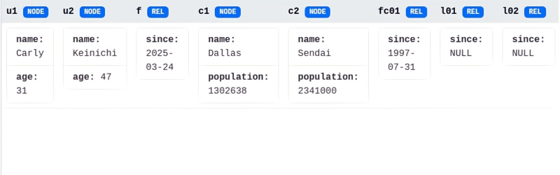
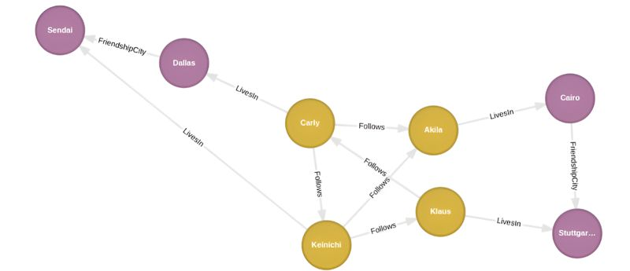

+++
title = "Cypher MATCH and WHERE"
date = "2025-03-29"
draft = false

[taxonomies]
tags=["Cypher", "KuzuDB"]

[extra]
comment = false
+++

## MATCH

In the [preceeding post](../../posts/cypher-create-return) we provisioned a graph network and populated it with nodes and relationships. There we saw how the
Kuzu Explorer displays the graph as interconnected nodes. Alternately the browser can also presents the data in tabular form as we have here.



When we want to query for patterns in the database, we turn to Cypher's ```MATCH``` clause. Because Cypher is a *declarative
language*, we only need to supply the pattern and leave it up to the query engine to retrive the matching data.

```cypher, linenos
MATCH (u: User {name: 'Carly'})
RETURN u
```
When we run this query at the command line, Kuzu returns the matching record.

```kuzu
{_ID: 0:0, _LABEL: User, name: Carly, age: 31}
```

## WHERE and the AS Operator

In the preceeding post we also introduced *variable labels* for graph nodes. These come in handy for pattern matching in Cypher
when we're using Cypher's ```WHERE``` clause. Combined with ```MATCH```, the ```WHERE``` clause accepts node lables and properties
as parameters for our query patterns, applying *pattern filters* that we supply.

```cypher, linenos
MATCH (u: User)
WHERE u.name = 'Keinichi'
RETURN u
```

```kuzu
{_ID: 0:1, _LABEL: User, name: Keinichi, age: 47
```
Cypher's pattern filters come with a number of logical operators. In the example below, we apply ```OR``` to expand
the scope of the filtered match.

```cypher, linenos
MATCH (u: User)
WHERE u.name = 'Keinichi' OR u.name = 'Carly'
RETURN u.name AS PERSON
```
```kuzu, linenos
PERSON
Carly
Keinichi
```
Note that we also used another Cypher operator in that last query: ```AS```.  The ```AS``` operator lets us introduce an alias for 
a variable reference to make the query result more readable.

In our final examples we run queries against a graph network loaded with a few more informationi. Our goal here is 
to use patterns that traverse the `LivesIn` and/or the `Follows` relationship(s) 
to link a user and a city.  



```cypher, linenos
MATCH (u: User)-[LivesIn]->(c: City)
WHERE u.name = 'Keinichi'
RETURN u.name AS USER, c.name AS CITY
```
```cypher, linenos
MATCH (c: City)<-[LivesIn]-(u: User)
WHERE u.name = 'Keinichi'
RETURN u.name AS USER, c.name AS CITY
```

```kuzu
USER|CITY
Kenichi|Sendai
```
In the first query above, we present two versions of the query, showing how flexible Cypher can be 
with relationship in the `MATCH` clause. The second query shows how we can chain nodes and relationships
to retrieve useful information from the graph.

```cypher, linenos
MATCH (u1: User)-[: Follows]->(u2: User)-[: LivesIn]->(c1: City)
WHERE u1.name = 'Keinichi'
RETURN u2.name AS PERSON, c1.name AS CITY, c1.population AS CITY_POPULATION
```

```kuzu
PERSON|CITY|CITY_POPULATION
Akila|Cairo|4493410
Klaus|Stuttgart|632865
```

### Source Code

The code cited in this post comes from `kuzu_match.rs`. To run that however, you'll need to execute `kuzu_create_return.rs` first
in order to provision a graph database and populate it with with data. `kuzu_create_return.rs` need only be executed once. 
Both Rust programs work with the graph database created in `/tmp/kuzu_db`.

[kuzu_create_return.rs](https://github.com/csaatechnicalarts/rust-graph-databases/blob/main/learn_cypher/src/bin/kuzu_create_return.rs)

[kuzu_match.rs](https://github.com/csaatechnicalarts/rust-graph-databases/blob/main/learn_cypher/src/bin/kuzu_match.rs)
<hr/>
