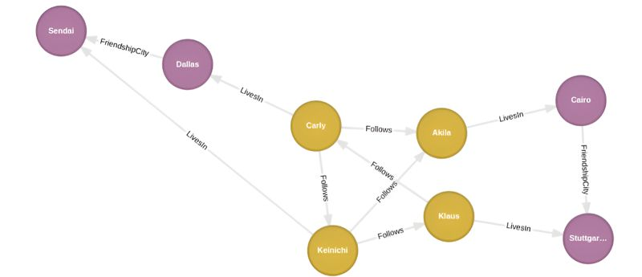
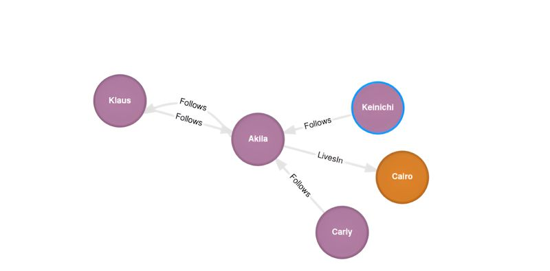
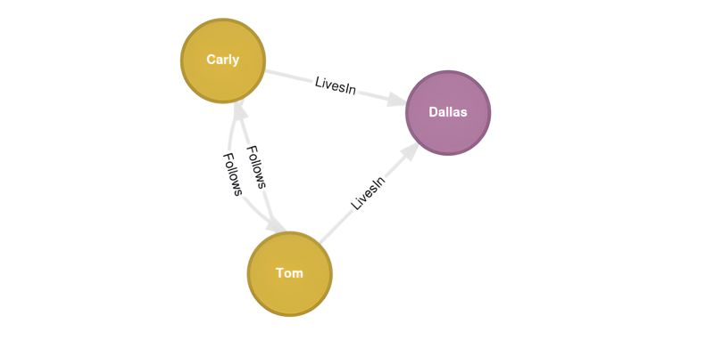

+++
title = "Cypher MERGE to Update the Graph Network"
date = "2025-04-02"
draft = false

[taxonomies]
tags=["Cypher", "KuzuDB"]

[extra]
comment = false
+++

## Graph Networks are Mutable



With the graph network we put together in [earlier posts](../../posts/cypher-create-return), we have users that follow one another in a unidirectional way. Let's say we want
to update the database such that not only does Carly follow Akila, but Akila too in reverse. Similarly we see that
Akila and Klaus do not follow one another; let's say we also want them to share a `Follows` relationship -- say Klaus
follows Akila. We accomplish this in Cypher using the `MERGE` clause.

## MATCH and then MERGE

In the Cypher language `MERGE` is the way by which we apply updates to the graph database. To use this clause, we must
first supply it with patterns that are anchored by Cypher reference variables. We do so by means of the `MATCH` clause. 
For example, here's how we create a relationship between two existing nodes:

```cypher, linenos
MATCH (u1: User {name: 'Klaus'})
MATCH (u2: User {name: 'Akila'})
MERGE (u1)-[:Follows {since: DATE('2024-01-25')}]->(u2)
MERGE (u2)-[:Follows {since: DATE('2024-01-25')}]->(u1)
RETURN u1, u2
```
Here our pattern matches the reference variables `u1` and `u2` with the nodes for Klaus and Akila. With this in hand 
we then create a pair of `Follows` relationships and store the new information to the graph database.



Knowing all this, it becomes trivial to insert a new `User` node into the graph network and create new `Follows`
relationships for it. 
```cypher, linenos
MATCH (c: City {name: 'Dallas'})
MATCH (u1: User {name: 'Carly'})
MERGE (u2: User {name: 'Tom', age: 22})
MERGE (u2)-[: LivesIn]->(c)
MERGE (u2)-[: Follows]->(u1)
MERGE (u1)-[: Follows]->(u2)
RETURN u1, u2, c 
```


Note that Cypher requires all `MATCH` patterns to come before `MERGE` clauses; changing the order leads to an error.

## Source Code

The code cited in this post comes from `kuzu_merge.rs`. To run that however, you'll need to execute 
`kuzu_create_return.rs` first in order to provision a graph database and populate it with with data. 
`kuzu_create_return.rs` need only be executed once. Both Rust programs work with the graph database 
created in `/tmp/kuzu_db`.

[kuzu_create_return.rs](https://github.com/csaatechnicalarts/rust-graph-databases/blob/main/learn_cypher/src/bin/kuzu_create_return.rs)

[kuzu_merge.rs](https://github.com/csaatechnicalarts/rust-graph-databases/blob/main/learn_cypher/src/bin/kuzu_merge.rs)
<hr/>
